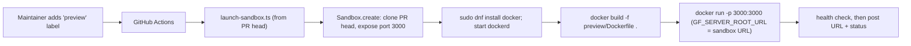

# Vercel Sandbox PR preview environments

This directory holds the build config and launcher for on-demand Grafana preview
environments backed by [Vercel Sandbox](https://vercel.com/docs/sandbox). When a
maintainer adds the `preview` label to a pull request, a GitHub Actions workflow
launches a sandbox that clones that PR's branch, builds the ClickHouse plugin
(frontend + Go backend) into a Grafana image, runs it with Docker, and posts a
temporary public URL back to the PR.

The preview Grafana points at ClickHouse's public demo
(`sql-clickhouse.clickhouse.com`, read-only `otel_demo` user, no password), so
there are no per-environment connection secrets to manage.

## Ephemeral, not persistent

Unlike a standing preview host, a Vercel Sandbox is ephemeral compute: it runs
for at most 45 minutes (Hobby) or 5 hours (Pro/Enterprise), and the public URL
only works while the session is alive. The launcher uses a ~50 minute window.
When it expires the URL stops responding; **re-apply the `preview` label** to
spin up a fresh one. The workflow keeps a single sticky comment and a
`preview/grafana` commit status up to date with the current URL and expiry.

## What's in here

- [`Dockerfile`](Dockerfile) - multi-stage build: frontend (`npm run build`),
  backend (`mage build:linux`, amd64 only since the sandbox runs in `iad1`),
  then a stock `grafana-enterprise` image with the built plugin baked into
  `/var/lib/grafana/plugins`.
- [`provisioning/datasources/clickhouse.yml`](provisioning/datasources/clickhouse.yml) -
  provisions the ClickHouse data source pointed at the public demo ClickHouse.
- [`launch-sandbox.ts`](launch-sandbox.ts) - the orchestrator: creates the
  sandbox, installs Docker, builds and runs the preview image, waits for Grafana
  to become healthy, and prints the public URL. Run via `npm run preview:launch`.
- [`../.github/workflows/preview.yml`](../.github/workflows/preview.yml) - the
  label-triggered workflow that runs the launcher and updates the PR.

## How it works



Security note: the workflow uses the `pull_request` trigger, so secrets and a
write-scoped token are only exposed to same-repo (maintainer) branches; fork PRs
from external contributors get a read-only token and no secrets and therefore
cannot launch a preview. Maintainers are expected to push branches to this repo.
The PR's plugin code is built **inside** the isolated sandbox microVM, never on
the runner.

## One-time setup

These steps are done once; they are not part of the repo.

1. **Create a Vercel access token.** In Vercel account settings, create a token
   scoped to the team that should own the sandboxes.
2. **Collect IDs.** Copy the team ID (team settings) and a project ID (any
   project's settings) the sandboxes should be billed/scoped to.
3. **Add GitHub repo secrets:**

   | Secret              | Source                       |
   | ------------------- | ---------------------------- |
   | `VERCEL_TOKEN`      | The access token from step 1 |
   | `VERCEL_TEAM_ID`    | Team settings                |
   | `VERCEL_PROJECT_ID` | Project settings             |

4. **Create the `preview` label** in the repo. Only users with write/triage
   permission can apply labels, which is what gates who can spin up previews.

### Plan notes

- A Vercel **Pro** plan is recommended: Hobby caps sandboxes at 45 minutes and
  5 CPU-hours per month, which is tight for repeated Grafana image builds.
- Sandboxes currently run only in the `iad1` region (amd64), which is why the
  Dockerfile builds a single architecture.

## Local sanity check

You can build and run the preview image locally without a sandbox:

```sh
docker build -f preview/Dockerfile -t ch-preview .

docker run --rm -p 3000:3000 ch-preview
```

Then open <http://localhost:3000> and confirm the ClickHouse data source is
provisioned (Connections -> Data sources -> ClickHouse) and can query the public
demo database (e.g. the `otel_v2` tables).

To exercise the full sandbox launcher locally, link a Vercel project
(`vercel link`, `vercel env pull`) or export `VERCEL_TOKEN`, `VERCEL_TEAM_ID`,
and `VERCEL_PROJECT_ID`, then set `PR_HEAD_REPO_URL` and `PR_HEAD_SHA` and run
`npm run preview:launch`.
